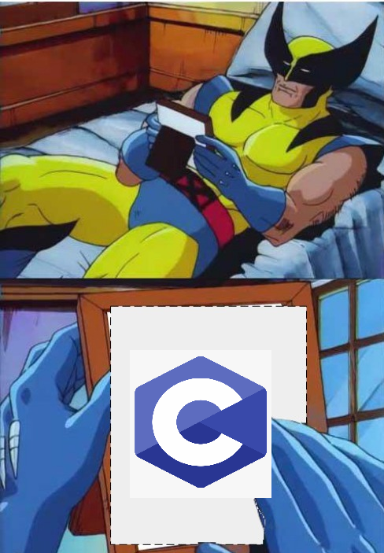

# Tutorial 1

## Expectations

- There are 3 tutorials at this time... you might not even be in the right one 🤔 (doesn't really matter).
- If you need extra help, you can sneak into another tute and/or lab (you just might not be prioritised... probably still better than the help sessions).
- If no one says anything, this just becomes another lecture... (but I won't force you).
- You can access this code at https://github.com/piddlingtuna/COMP1521_21T3.

### Poll
How many lectures have you watched?


## 👏👏 Meme Review 👏👏


Thanks for your dank memes...

If you didn't get my email...


## Breakout Rooms

lEt'S dO aN iCeBrEaKeR...
- 2 truths, 1 lie (but we don't have time to say which is the lie).
- Google Jamboard


## Tips

This course has two halves:

- First half: How does everything get translated into 1s and 0s?

Short answer: representation - we agree on a common meaning of bit patterns (checkout [`./hexadecimal.md`](./hexadecimal.md)).

- Second half: How do we get the OS to do stuff for us?

Short answer: `man 2 whatever` to find out!



If you have forgotten C, it is highly recommended you speed run https://learnxinyminutes.com/docs/c/.

In C, you have to manage your own memory. Remember Newton's Law:


It's recommended to use `dcc`. You can ask in the lab if you want help to install it locally.


## Something Cool

Checkout out [`./buffer_overflow.c`](./buffer_overflow.c)

What is going on?


## Something Cruel

Checkout out [`./static_variable.c`](./static_variable.c)


### Poll
Is C a well designed language?


## Questions

Access these questions at https://cgi.cse.unsw.edu.au/~cs1521/21T3/tut/01/questions.


2. Consider the following C program skeleton:

```c
int  a = 0;
char b[100] = {'\0'};

int fun1() {
    int c = 0;
    int d = 0;
    ...
}

double e = 1.0;

int fun2() {
    int f = 0;
    static int ff = 0;
    
    ...
    fun1();
    ...
}

int g = 0;

int main(void) {
    char h[10] = {'\0'};
    int i = 0;
    ...
    fun2();
    ...
}
```

Now consider what happens during the execution of this program and answer the following:

a. Which variables are accessible from within main()?

b. Which variables are accessible from within fun2()?

c. Which variables are accessible from within fun1()?

d. Which variables are removed when fun1() returns?

e. Which variables are removed when fun2() returns?

f. How long does the variable f exist during program execution?

g. How long does the variable g exist during program execution?


3. Explain the differences between the properties of the variables s1 and s2 in the following program fragment:

```c
#include <stdio.h>

char *s1 = "abc";

int main(void) {
    char *s2 = "def";
    ...
}
```

Where is each variable located in memory? Where are the strings located?


4. C's sizeof operator is a prefix unary operator (precedes its 1 operand) - what are examples of other C unary operators?


5. Why is C's sizeof operator different to other C unary & binary operators?


6. Discuss errors in this code:

```c
struct node *a = NULL;
struct node *b = NULL;
struct node *c = NULL;
struct node *d = NULL;
a = NULL:
b = malloc(sizeof b);
c = malloc(sizeof struct node);
d = malloc(8);
c = a;
d.data = 42;
c->data = 42;
```

7. What is a pointer? How do pointers relate to other variables?


8. Consider the following small C program:

```c
#include <stdio.h>

int main(void) {
    int n[4] = { 42, 23, 11, 7 };
    int *p;

    p = &n[0];
    printf("%p\n", p); // prints 0x7fff00000000
    printf("%lu\n", sizeof (int)); // prints 4

    // what do these statements print ?
    n[0]++;
    printf("%d\n", *p);
    p++;
    printf("%p\n", p);
    printf("%d\n", *p);

    return 0;
}
```

Assume the variable n has address 0x7fff00000000.

Assume sizeof (int) == 4.

What does the program print?


9. Consider the following pair of variables

```c
int  x;  // a variable located at address 1000 with initial value 0
int *p;  // a variable located at address 2000 with initial value 0
```

If each of the following statements is executed in turn, starting from the above state, show the value of both variables after each statement:

a. p = &x;

b. x = 5;

c. *p = 3;

d. x = (int)p;

e. x = (int)&p;

f. p = NULL;

g. *p = 1;

If any of the statements would trigger an error, state what the error would be.


## Recursion

Checkout out [`./q10.c`](./q10.c)


## Structs

Checkout out [`./q14.c`](./q14.c)


## Labs

Available at: https://cgi.cse.unsw.edu.au/~cs1521/21T3/lab/01/questions

**Please don't use Microsoft's Remote - SSH extension on VSCode - use the SSH FS extension instead.**

If you ignore my advice, don't blame me if Corelli crashes during your exam.

Raise your hand if your room needs help 👋

Tip: type `man 3 getchar`.

Tip: For non-challenge exercises, you are encouraged to help each other out!

### Question
How should breakout rooms be organised?

P.S. There will be a room for Home Computing.
