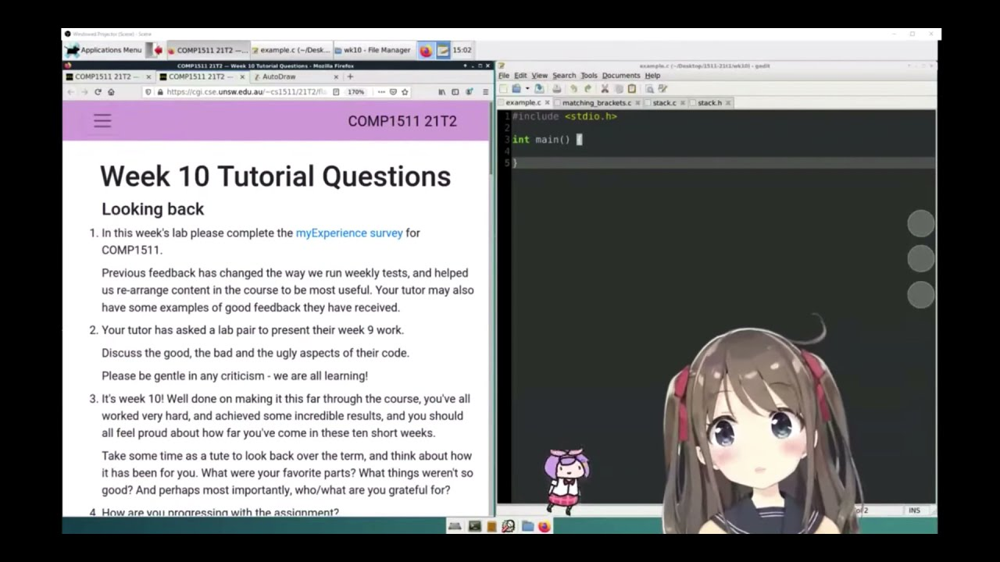
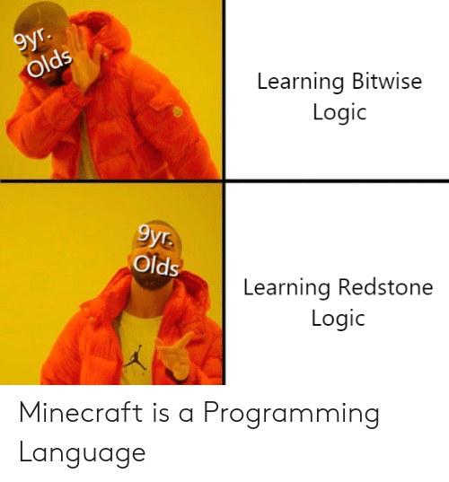
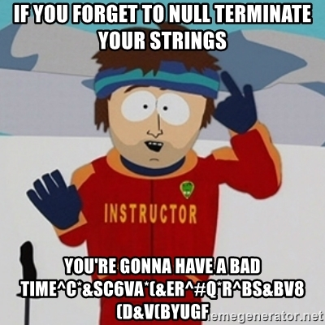

# Tutorial 2


I am not the vtutor.




## Everything is bits

**When we use bitwise operations, we treat everything as an array of bits.**

An int is an array of bits of length 32.

A short looks like: 0b 0010 0001 0000 0001

A double is an array of bits of length 64.

```
$ ./sixteen_in 0011001100110011
13107
$ ./sixteen_out 13107
0011001100110011
```




## How long should a string be?

In C, strings are null terminated.

They always end in '\0'.

If you want an 8 character long string, allocate 9 bytes.

Note that `strlen` returns the length excluding '\0'.

```c

char *string = malloc((8 + 1) * sizeof char);
...
string[8] = '\0';

```


## You should now understand this!




## What is a bcd?

In a BCD, we never see 0xA, 0xB, 0xC, 0xD, 0xE or 0xF.


### Unpacked BCD

8 bits per BCD (4 bits are wasted)

        0x0102 == 0b 0000 0001 0000 0010
                     |-------| |-------|
                         1         2

        0x0402 == 0b 0000 0100 0000 0010
                     |-------| |-------|
                         4         2

Every byte ranges from 0x00 to 0x09.

byte: 0 -> 255
BCD: 0 -> 9

258  == 0x0102 == 0b 0000 0001 0000 0010 -> 12

1026 == 0x0402 == 0b 0000 0100 0000 0010 -> 42


### Packed BCD

4 bits per BCD (0 bits are wasted)

        0x12 == 0b 0001 0010
                   |--| |--|
                    1    2

        0x42 == 0b 0100 0010
                   |--| |--|
                    4    2

Every 4-bits ranges from 0x0 to 0x9.

4-bits: 0 -> 15
BCD: 0 -> 9

18 == 0x12 == 0b 0001 0010 -> 12

66 == 0x42 == 0b 0100 0010 -> 42

0b 0001 0010
0b 0000 1111

one_digit = 0x12 & 0x0F == 2
ten_digit = (0x12 & 0xF0) >> 1

0b 0001 0010
0b 1111 0000 &
0b 0001 0000 >> 4 == 0b 0000 0001
