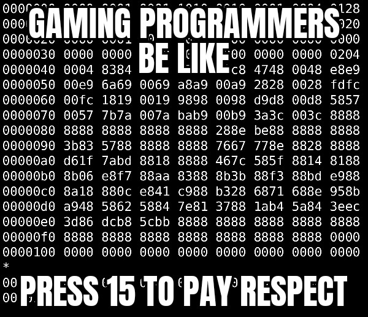

# Bases in C

How can you tell if an integer constant in a C program is decimal (base 10), hexadecimal (base 16), octal (base 8) or binary (base 2)?


0x = hex
0b = binary
0 = oct // 0o would be better

Do you think this is good language design?

Language trivia: what base is the constant 0 in C?

And the constant 0 in C is actually octal because it starts with 0. But it doesn't matter because 0 is denoted the same in all bases.


## Decimal

123 == 1 * 100 + 2 * 10 + 3 * 1 == 100 + 20 + 3 == 123

... + (0...9) * 10000 + (0...9) * 1000 + (0...9) * 100 + (0...9) * 10 + (0...9) * 1


## Converting from Binary

0b10101 == 1 * 16 + 0 * 8 + 1 * 4 + 0 * 2 + 1 * 1 == 16 + 4 + 1 == 21

... + (0...1) * 16 + (0...1) * 8 + (0...1) * 4 + (0...1) * 2 + (0...1) * 1


## Converting from Octal

0o10101 == 1 * 4096 + 0 * 512 + 1 * 64 + 0 * 8 + 1 * 1 == 4096 + 64 + 1 = 4161

... + (0...7) * 4096 + (0...7) * 512 + (0...7) * 64 + (0...7) * 8 + (0...7) * 1

## Converting to Hexadecimal

A == 10
B == 11
C == 12
D == 13
E == 14
F == 15

0x1A == 1 * 16 + A (== 10) * 1 == 16 + 10 == 26

... + (0...F) * 4096 + (0...F) * 256 + (0...F) * 16 + (0...F) * 1

0xF = 0b1111 == 1 * 8 + 1 * 4 + 1 * 2 + 1 * 1 == 15

## You should now understand this!




# Some Practice

Show what the following decimal values look like in 8-bit binary, 3-digit octal, and 2-digit hexadecimal:

a. 1

0b0000 0001
0o0001
0x01

b. 8

0b000 1000
0o010
0x08

c. 10


d. 15


c. 16


d. 100

100 - 64 == 36
36 - 32 == 4
4 - 4 == 0

log2 of 100 = 6.64385618977
rounded down == 6
2 ** 6 == 64

0b0110 0100
0x64


e. 127


f. 200


How could I write a C program to answer this question?

```c
printf("%d == %o == %x", 100, 100, 100);
```
There is no `%b`
