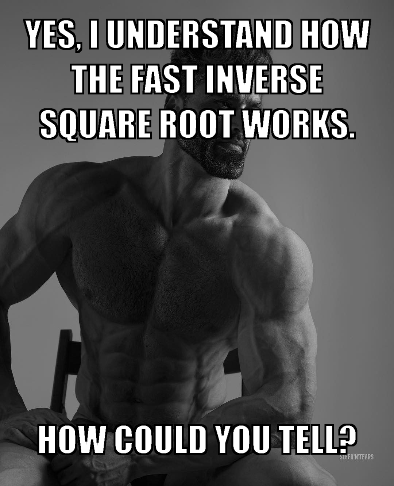
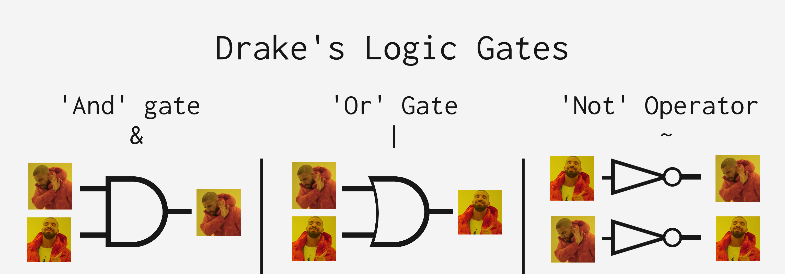
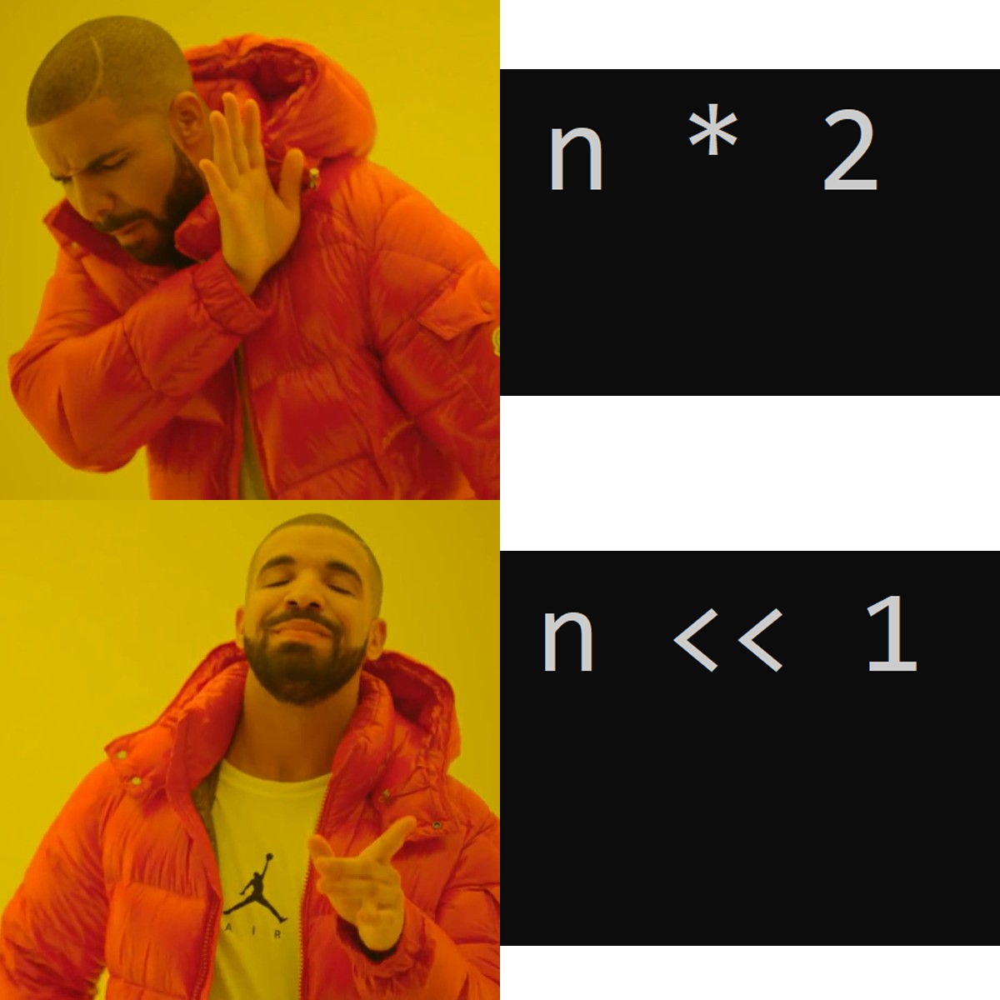

# Bitwise Operations

- You just want to manipulate individual bits
- This are MEGA fast 🏃🏃🏃!!!

```c
float Q_rsqrt( float number )
{
	long i;
	float x2, y;
	const float threehalfs = 1.5F;

	x2 = number * 0.5F;
	y  = number;
	i  = * ( long * ) &y;                       // evil floating point bit level hacking
	i  = 0x5f3759df - ( i >> 1 );               // what the fuck? 
	y  = * ( float * ) &i;
	y  = y * ( threehalfs - ( x2 * y * y ) );   // 1st iteration
//	y  = y * ( threehalfs - ( x2 * y * y ) );   // 2nd iteration, this can be removed

	return y;
}
```




## AND

& 1 0
1 1 0
0 0 0

if (both 1) {
    return 1;
} else {
    return 0;
}


## OR

This is different to OR in English...

| 1 0
1 1 1
0 1 0

if (both 0) {
    return 0;
} else {
    return 1;
}


## NOT

~ 1
1 0
0 1


## You should now understand this!




# XOR

This is OR in English...

^ 1 0
1 0 1
0 1 0

if (both the same) {
    return 0;
} else {
    return 1;
}

Fun fact: the inverse of XOR is... XOR!!!

a XOR b XOR b == a

# Left Shift

0b0001 << 1 == 0b0010
     1 << 1 == 2
     1 * 2

0b0011 << 2 == 0b1100
     3 << 2 == 12
     3 * 2 * 2 == 12

0b0001 << 4 == 0b0000


What mathemtical operation is this equivalent to?


## You should now understand this!



## Right Shift

uint8_t i = 0b1001 0000;

0b1001 0000 >> 2 ==
0b0010 0100

USE UNSIGNED WITH BITWISE WHEN YOU CAN!!!

# Exercise

```c
#include <stdint.h>

uint16_t a = 0x5;
uint16_t b = 0xA;
uint16_t c = 0x1;
```
small brain: value & mask
big brain: value | mask

Converting to binary:

0x5 == 0b0101
0xA == 0b1010
0x1 == 0b0001

What are the values of the following expressions:

a. a | b (bitwise OR) == 0xF


b. a & b (bitwise AND) == 0x0


c. a ^ b (bitwise XOR) == 0xF


d. a & ~b (bitwise AND, bitwise NOT) == 0x5


e. c << 6 (left shift)


f. a >> 4 (right shift)


g. a & (b << 1)


i. b | c


h. a & ~c
