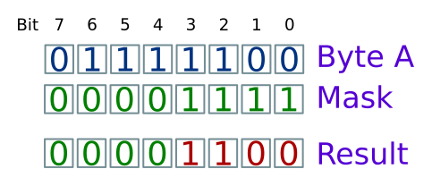

# Flags and Masks

We use masks to select bits.

A flag is a mask that lets us select a particular bit




## Exercise

Consider a scenario where we have the following flags controlling access to a device.

```c
#define READING   0x01 == 0b00000001

#define WRITING   0x02 == 0b00000010

#define AS_BYTES  0x04 == 0b00000100

#define AS_BLOCKS 0x08 == 0b00001000

#define LOCKED    0x10 == 0b00010000
```

The flags are contained in an 8-bit register, defined as:

```c
unsigned char device;
```

Write C expressions to implement each of the following:


a. mark the device as locked for reading bytes

```c
// TODO
```

b. mark the device as locked for writing blocks

```c
// TODO
```

c. set the device as locked, leaving other flags unchanged

```c
// TODO
```

d. remove the lock on a device, leaving other flags unchanged

```c
// TODO
```

e. switch a device from reading to writing, leaving other flags unchanged

```c
// TODO
```

f. swap a device between reading and writing, leaving other flags unchanged

```c
// TODO
```
