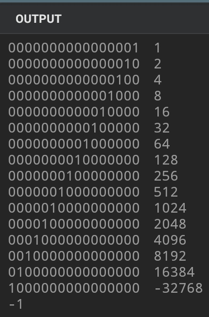

# Singed integers

## Signed/Unsigned Bit

0    0    0    0    0    0    0    0 
+/-  64   32   16   8    4    2    1 1/2 1/4 1/8
+/-  2^6  2^5  2^4  2^3  2^2  ^1  2^0 2^-1 2^-2

## What's the Problem?

0 == Positive
1 == Negative

(-1)^sign
-1^0 = 0
-1^1 = -1

+0 == 0000 0000
-0 == 1000 0000

Two zeroes?

if (+0 == -0) {

}

## One's Complement

To convert from + to -, bitwise not. Works both ways!

5  == 0000 0101
-5 == 1111 1010

What's the Problem?

0  == 0000 0000
-0 == 1111 1111

Two zeroes?

if (+0 == -0) {

}

## Two's Complement

0    0    0    0    0    0    0    0
-128 64   32   16   8    4    2    1
-2^7 2^6  2^5  2^4  2^3  2^2  2^1  2^0

To convert from + to -, bitwise not and + 1. Works both ways!

6    == 0000 0110
~6   == 1111 1001
~6+1 == 1111 1010

0    == 0000 0000
~0   == 1111 1111
~0+1 == 0000 0000
-0   == 0000 0000

One zero?

if (0 == 0) {

}

## Diagram

## Assume that the following hexadecimal values are 16-bit twos-complement. Convert each to the corresponding decimal value.

i.      0x0013 == 0b 0000 0000 0001 0011
               == TODO

ii.     0x0444 == 0b 0000 0100 0100 0100
               == TODO

iii.    0x1234 == 0b 0001 0010 0011 0100
               == TODO

iv.     0xffff == 0b 1111 1111 1111 1111
               == TODO

v.      0x8000 == 0b 1000 0000 0000 0000
               == TODO
