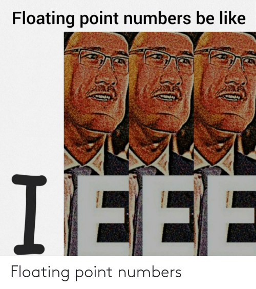
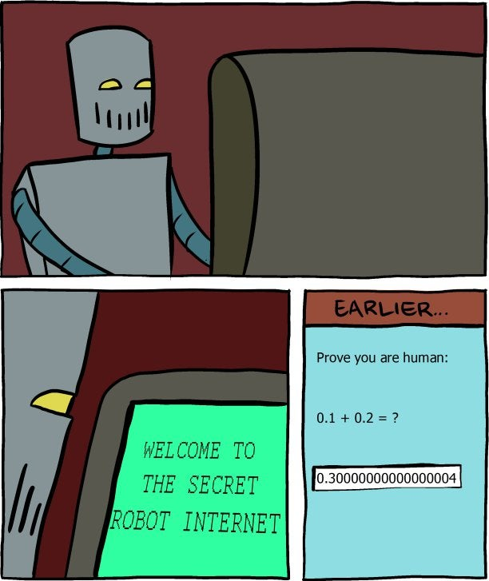

# Float

## IEEE

## IEE 754

(-1)^sign × (1 + frac) × 2^(exp − 127)
1 bit  8 bits   23 bits
0      01111110 01001000010001000100010
^      |------| |---------------------|
sign    exp      frac

double
1 bit == sign
11 bits == exp
52 bits == frac

## Significant figures in base 2

5.053 x 10^3 == 5053.0
4.911 x 10^-2 == 0.04911

1.110101 x 2^1101

## Why don't we store the 1?

11.01 x 10^1 == 1.101 x 10^2
0.7892 x 10^-3

11.10 x 2^11
0.11 x 2^0 == 1.1 x 2^-1

## Why do we have a 'bias'?

exp == 8 bits
0 to 255
-127 to 128

## Where can floats go wrong?

// int
59 + 1 = 60

// float
59 + 1 = 59

2.666 x 10^9 + 1.000 x 10^1 = ??????
== 2 666 000 000 + 10
== 2 666 000 010
== 2.6660000010 x 10^9
== 2.666 x10^9

## Meme

## Special Values

### Zero

+0.0 == 0 00000000 00000000000000000000000
-0.0 == 1 00000000 00000000000000000000000

### Positive Infinity

+inf == 0 11111111 00000000000000000000000

### Negative Infinity

-inf == 1 11111111 00000000000000000000000

### NaN (Not a Number)

NaN == 0 11111111 10000000000000000000000

## What decimal numbers do the following single-precision IEEE 754-encoded bit-strings represent?

a. 0 00000000 00000000000000000000000

(-1)^sign × (1 + frac) × 2^(exp − 127)

b. 1 00000000 00000000000000000000000

(-1)^sign × (1 + frac) × 2^(exp − 127)

c. 0 01111111 10000000000000000000000

(-1)^sign × (1 + frac) × 2^(exp − 127)

d. 0 01111110 00000000000000000000000

(-1)^sign × (1 + frac) × 2^(exp − 127)

e. 0 01111110 11111111111111111111111

(-1)^sign × (1 + frac) × 2^(exp − 127)

f. 0 10000000 01100000000000000000000

(-1)^sign × (1 + frac) × 2^(exp − 127)

g. 0 10010100 10000000000000000000000

(-1)^sign × (1 + frac) × 2^(exp − 127)

f. 0 01101110 10100000101000001010000

(-1)^sign × (1 + frac) × 2^(exp − 127)
