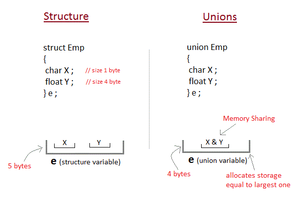

# Structs vs Unions

## Draw diagrams to show the difference between the following two data structures:

```c
struct {
	int a; // 4 bytes
	double b; // 8 bytes
} x1; //sizeof == 4 + 8 == 12

struct x1 example;
example.a = 5;
example.b = 1.04;
```

--------------------
| int a | double b |
--------------------

```c
union {
	int a; // 4 bytes
	double b; // 8 bytes
} x2; // sizeof == 8

struct x2 example;
example.a = 5;
example.b = 234.2;
example.a == ????;
```


---------------------
| int a or double b |
---------------------


## Diagram




## If x1 was located at &x1 == 0x1000 and x2 was located at &x2 == 0x2000, what would be the values of:

```c
struct {
	int a; // 4 bytes
	double b; // 8 bytes
} x1; //sizeof == 4 + 8 == 12
```

&x1 == 0x1000

&x1.a == 0x1000

&x1.b == 0x1004

```c
union {
	int a; // 4 bytes
	double b; // 8 bytes
} x2; // sizeof == 8
```

&x2 == 0x2000

&x2.a == 0x2000

&x2.b == 0x2000
