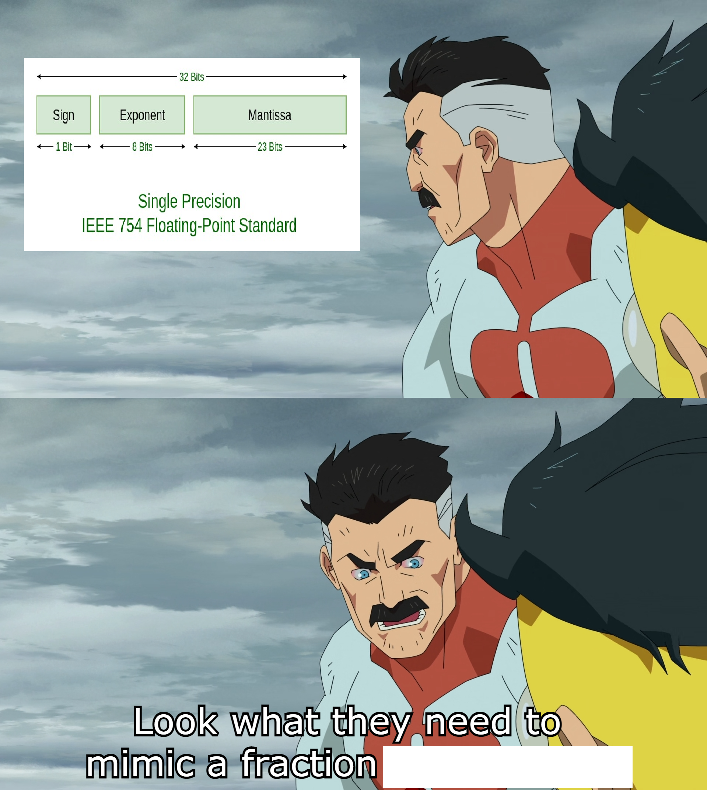
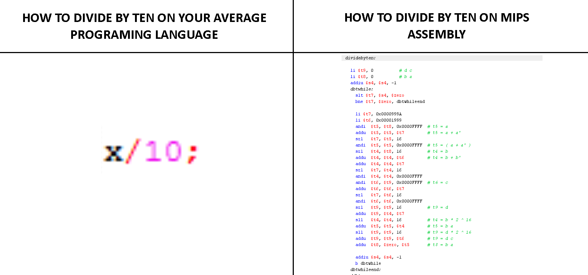
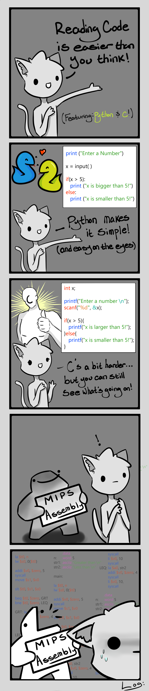
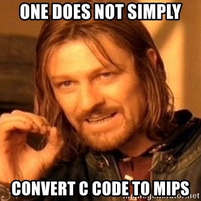
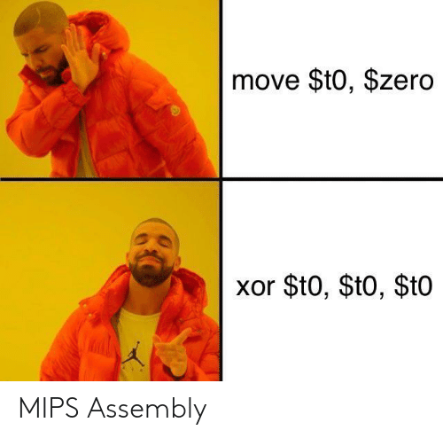

# Tutorial 4

Revision for last week https://evanw.github.io/float-toy/

## Fun Fact

"The Nintendo 64, along with the PlayStation, were among the highest volume users of MIPS architecture processors in the mid-1990s." - Wikipedia

## What is MIPS?

Python - high level

C, C++, etc

Assembly - MIPS, x86, ARM

Machine code - low level

## Why are we learning MIPS?

## Useful Links

### MIPS Instruction Set

https://cgi.cse.unsw.edu.au/~cs1521/21T3/resources/spim-guide.html

### MIPS Tutorial

https://cgi.cse.unsw.edu.au/~cs1521/21T3/resources/spim-tute.html

### Jashank's Style Guide

https://wiki.jashankj.space/Scribblings/BetterAssembly/

## How to Code in MIPS?

- Have the instruction set open.
- Have the C code open.
    - Except for some challenge exercises, you will always be given the equivalent C code.
    - It might be better to translate the C code into MIPS like C code.
- Include the equivalent C code in comments.
- On top of every function, include a comment with:
    - Frame: registers stored on the stack.
    - Uses: registers where the value is used.
    - Clobbers: registers where the value is changed.

## How to run MIPS?

### SPIM

TODO

**Your code will be tested with SPIM.**

### QtSpim

Todo

### Mipsy

TODO

**If you use Mipsy, make sure you test it with SPIM.**

## Big Brain Meme

