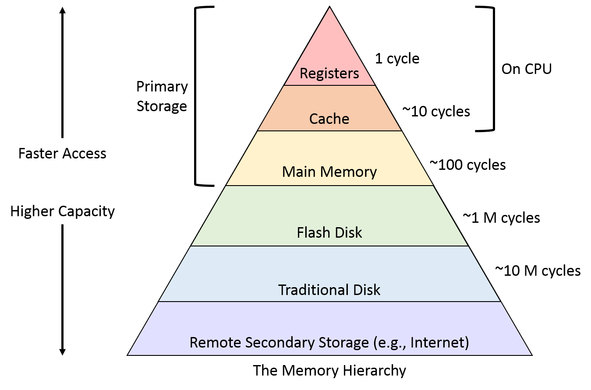

# Question 2

The MIPS processor has 32 general purpose 32-bit registers, referenced as $0 .. $31. Some of these registers are intended to be used in particular ways by programmers and by the system. For each of the registers below, give their symbolic name and describe their intended use: 

int $0;
int $1;
int $2;
...
int $31;

Registers - really fast (ns), really expensive

main memory - ok in speed (10s/100s of ns), ok in cost (gigabytes)

Hard disk drive - really slow (10s/100s of ms), really cheap (terabytes)

## Instruction set

https://cgi.cse.unsw.edu.au/~cs1521/21T3/resources/spim-guide.html

## Zero register
$0 == $zero
0b 0000 0000 0000 0000 0000 0000 0000 0000

This never changes... it's always just 0.

## Assembler temporary register
$1 == $at

Some instructions we're learning are actually pseudo-instructions that are two actual instructions and the assembler using this to store temporary results.

Probably avoid using this as the assembler might overwrite its value...

## Value registers
$2-$3 == $v0-$v1

Why do we need two return values?

int == v0 == 32 bits

double == 64 bits == v0 + v1

Except for syscalls

## Argument registers

$4-$7 == $a0-$a3

What if we have more than 4 arguments?
Stack

## Temporary registers
$8-$15 == $t0-$t9

The callee's reponsibility.

int i = 1; # t0
int j = 2; # t1

int k = 0; # t0
int return_value = add(i, j); - 0xff00
// $t0 != 1?

int add(int i, int j) {
    // completely free to muck with your $t registers
}

## Safe registers

$16-$25 == $s0-$s9

The caller's reponsibility. You *must* first safe $s registers inside the add function.

int i = 1; # s0
int j = 2; # s1
int return_value = add(i, j); - 0xff00
// $s0 == 1;
// $s1 == 2;

int add(int i, int j) {
    // save old $s0 onto the stack.
    // I want to use $s0
    // completely free to muck with your $t registers
    // restore old $s0 from the stack
}

## Kernel registers
$26-$27 == $k0-$k1

These are reserved by the operating system so just don't touch them...

What if you divide by 0?

## Global pointer
$28 == $gp

Worry about this later...

## Stack pointer
$29 == $sp

Holds the address of the stack (available memory).

Its initial value is 0x7FFFFEFC and it goes down.

## Frame pointer
$30 == $fp

Worry about this later...

## Return address
$31 == $ra

It holds the address where the function should return to.

It is invoked by `jr $ra`.

## Conventions

The above register uses are (almost) all convention.

$0 == $zero is read-only.

$1 == $at is used by the assembler so it may change randomly.

$26-$27 == $k0-$k1 is used by the kernel so it may change randomly... except we are on an emulator!

$31 == $ra

However, compilers (think dcc, gcc) use this so programs can work together. Ignoring the conventions means your MIPS won't work with compiled C.

So:
    - Functions

## j vs b

`b address` is the same as `beq $zero, $zero, address`

b 100

PC = PC + 100

j 100

PC = 100

b is relative.

j is absolute.

b is slightly faster.

j is slightly more robust.

## .text vs .data

`.text` means run this code.

`.data` means place this in memory.

By default, assembly starts in `.text`.

If you place your `.data` first, make sure you place `.text` somewhere after it.
