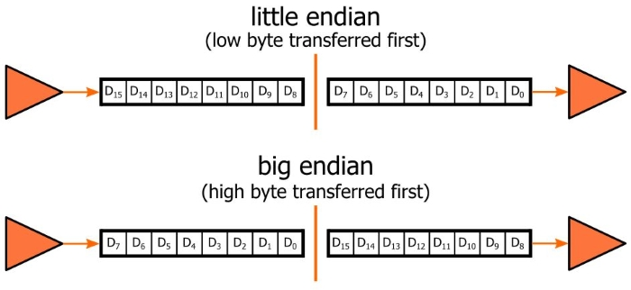

Consider the following memory state:

Address       Data Definition
0x10010000    aa:  .word 42
0x10010004    bb:  .word 666
0x10010008    cc:  .word 1
0x1001000C         .word 3
0x10010010         .word 5
0x10010014         .word 7

    .data
aa:
    .word 42

la $t0, aa          # loads the address 'aa' into $t0
like a pointer

lw $t1, ($t0)       # loads the contents of 'aa' into $t1
like deferencing a pointer

li == load 32-bit constant
la == load 32-bit address # 4 bytes

lb == load byte # byte == char
lh == load half word == load 2 bytes
lw == load word == load 4 bytes

sb == save byte # byte == char
sh == save half word == save 2 bytes
sw == save word == save 4 bytes

What address will be calculated, and what value will be loaded into register $t0, after each of the following statements (or pairs of statements)?

Address       Data Definition
0x10010000    aa:  .word 42
0x10010004    bb:  .word 666
0x10010008    cc:  .word 1
0x1001000C         .word 3
0x10010010         .word 5
0x10010014         .word 7

## a.
la   $t0, aa
$t0 = 0x10010000

## b.
lw   $t0, aa
$t0 = 666

## c. Let's skip this..
lb   $t0, bb

Address       Data Definition
0x10010000    aa:  .word 42
0x10010004    bb:  .word 666
0x10010008    cc:  .word 1
0x1001000C         .word 3
0x10010010         .word 5
0x10010014         .word 7

## d.
lw   $t0, aa+4
$t0 = 666

## e.
la   $t1, cc
lw   $t0, ($t1)
$t1 = 0x10010008
$t0 = 1

## f.
la   $t1, cc
lw   $t0, 8($t1) # addr = 0x10010008 + 8 == 0x10010010
$t1 = 0x10010008
$t0 = 5

## g.
li   $t1, 8
lw   $t0, cc($t1)
$t1 = 8
$t0 = 5

## h.
la   $t1, cc
lw   $t0, 2($t1)

## Litte Endian vs Big Endian

0x029a == 0b 0000 0010 1001 1010 1111 0111

0000 0010 10011010 11110111 - big endian
|                 |
start            end

0b 11110111 10011010 00000010 - little endian
|                 |
start            end

Most computers (including CSE computers) are actually little endian.

**This only affects whole bytes.**

**This only affects RAM, not registers.**

666 == 0x029a

00 00 02 9a

9a 02 00 00

9a

Since we are dealing with little-endian, 0x9a is loaded.

We aren't done yet! 0x9a == 0b1001 1010 - this is negative in two's complements

lb sign extends, so $t0 becomes 0xffffff9a.

Address       Data Definition
0x10010000    aa:  .word 42
0x10010004    bb:  .word 666
0x10010008    cc:  .word 1
0x1001000C         .word 3
0x10010010         .word 5
0x10010014         .word 7

## Let's go back to c

lb   $t0, bb
$t0 == 0xffffff9a

0b1111 1 1111 1111 1111 ... 1001 1010
