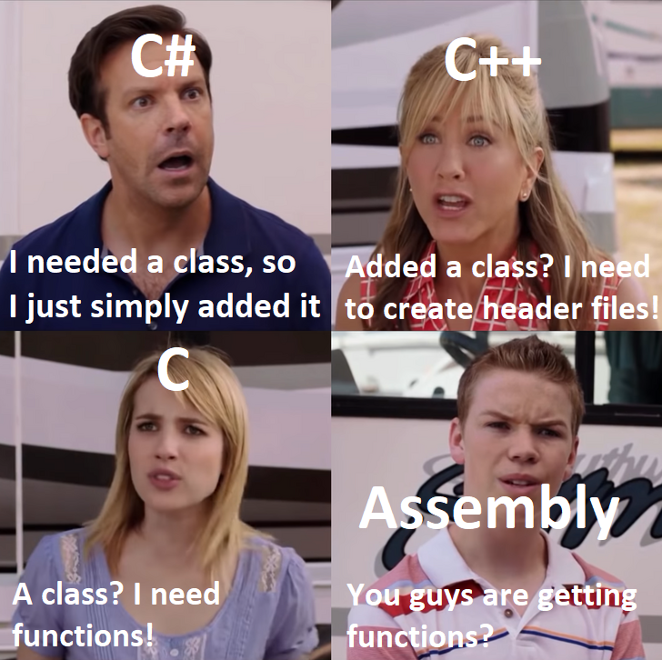

# Tutorial 7

## Arrays


## Functions



## Assignment 1

Any questions?

> Did you definitely write the prologue and epilogue correctly?

Make sure you included every `$s` register used (and don't include any `$a` registers)!

It will a bit like:
```
prologue:
    addi $sp, $sp, -8
    sw   $ra, 0($sp)
    sw   $s0, 4($sp)

epilogue:
    sw   $s0, 4($sp)
    sw   $ra, 0($sp)
    addi $sp, $sp, 8
```

> Did you use `$t` and `$s` registers correctly?

After you call a function, you are only guaranteed `$ra` and `$s` registers do not change.

```
$a0 == 5
$t0 == 6
$s0 == 7
function(..., ...)
$a0 == ???
$t0 == ???
$s0 == 7
```

> Did you definitely write the variable back to memory?

Try that first...

It will a bit like:
```
    lb  $t1, ($t0)
    ori $t1, $t1, MASK
    sb  $t1, ($t0)
```

> Do you know how to use structs in MIPS?

I shall explain...
