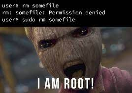

We say that the Unix filesystem is tree-structured, with the directory called / as the root of the tree.

Answer the following based on the above diagram:

    a. What is the full pathname of COMP1521's web directory?
/home/cs1521/web - full pathname

    b. Which directory is ~jas/../..?
/
    
"/" - root
"." - current directory
".." - parent directory
"~" - home directory

    c. Links to the children of a given directory are stored as entries in the directory structure. Where is the link to the parent directory stored?
files:
    - regular files
    - directories - file name to file

    d. What kind of filesystem object is cat?
regular file

    e. What kind of filesystem object is home?
directory

    f. What kind of filesystem object is tty0?
physical devices

    g. What kind of filesystem object is a symbolic link? What value does it contain?

    h. Symbolic links change the filesystem from a tree structure to a graph structure. How do they do this?

