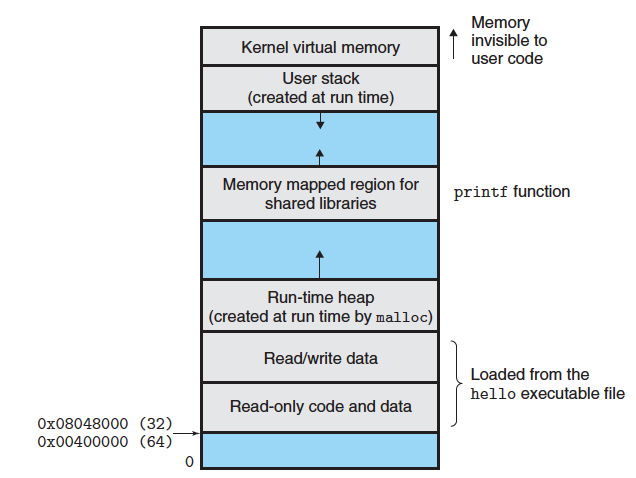
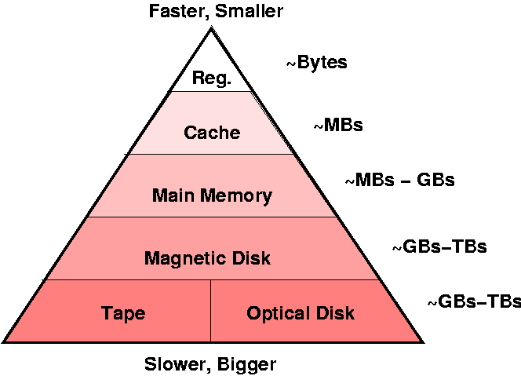

# Tutorial 10

## Assignment 2

How is the assignment going?

https://cgi.cse.unsw.edu.au/~cs1521/21T3/assignments/ass2/index.html

## Virtual Memory

### Why use virtual memory?

You have 4 GB of RAM but want to run processes that take up 8 GB of RAM.

Solution: virtual memory!

RAM - fast but small
Hard drive - really large (a lot slower)

Advantages:
- Allows a computer to use more RAM than it actually has.
- Lazy loading - only load memory you actually use.
- Share read-only memory like libraries (think <stdio.h>).

Disadvantages:
- Assembly (i.e. MIPS) works on actual, physical addresses.
    - But you won't know what actual address you will be given?
    - Must semi-recompile before you run a program.
    - Virtual addressing avoids this (translation is done by hardware).

q5) Each new process in a computer system will have a new address space. Which parts of the address space contain initial values at the point when the process starts running? Code? Data? Heap? Stack? Which parts of the address space can be modified as the process executes?

### What is virtual memory?

Physical memory is split into equal sized frames.

Virtual memory is split into equal sized pages.

A frame is the same size as a page.

Frame/page size is a power of 2.

4k == 4096 bytes

Whenever you access memory, translate virtual page to physical frame.
- Slower than if we just use physical memory.
- Memory management unit (MMU) - translations really fast

Could work with varying sized pages/frames but a lot harder and slower.

Could work with non power of 2 sizes but slower - power of 2 lets you use bitwise operators.

16 / 2 == 16 >> 1
0b010000 / 2 == 0b001000

**What is the difference between a virtual address and a physical address?**

### Translation

#define PAGE_SIZE 4096

page_table is an array
- index is your virtual memory page number.
- value is your physical frame number.

page_number = virtual_address / PAGE_SIZE; (integer division)
offset = virtual_address % PAGE_SIZE;
physical_address = PAGE_SIZE * page_table[page_number] + offset;

| Virtual Page | Physical Frame|
|--------------|---------------|
| 0            | 3             |
| 1            | 2             |
| 2            | 0             |
| 3            | 1             |

**Given a virtual address of 10000, what is the physical address?**

page_number = 10000 / 4096 = 2;
offset = 10000 % 4096 = 1808;
physical_address = 4096 * 0 + 1808 = 1808;

**Given a virtual address of 5096, what is the physical address?**

page_number = 5096 / 4096 = 1;
offset = 5096 % 4096 = 1000;
physical_address = 4096 * 2 + 1000 = 9192;

If a virtual page is not in physical memory:
- there isn't enough physical memory.
- it hasn't been used yet (lazy loading).

This causes a page fault. The page is loaded from the hard drive into RAM.

### Least Recently Used

Virtual memory let's you have more virtual memory (pages) than actual physical memory (frame).

So we may have to kick out some pages if #pages > #frames.

How do we decide which frames to kick out?

Page not used recently probably won't be needed again soon.

// 1) The virtual page is already in a physical page
// Update counter
//
// 2) The virtual page is not in a physical page,
//    and there is free physical page
//
// 3) The virtual page is not in a physical page,
//    and there is no free physical page

Assume we have 6 virtual memory pages and 4 physical memory frames
and are using a least-recently-used (LRU) replacement strategy.

**What will happen if these virtual memory pages were accessed?**

5 3 5 3 0 1 2 2 3 5

Inverted page table

Clock: 0

| Frame | Page | Last Used |
|-------|------|-----------|
| 0     |  0   | 0         |
| 1     |  0   | 0         |
| 2     |  0   | 0         |
| 3     |  0   | 0         |

Note: Least recently used is the best possible algorithm. However, it is too slow too to be practical in a real OS.

### Page fault

**Only when it hits a page that does not exit.**

When we try to a page in physical RAM but it isn't there. :(

We load it in from the hard drive.

This is called demand paging.

It is really slow...

### Thrashing

Why do all the kicked out pages go?

HDD is 1 000 000x slower than RAM.
SDD is 10 000x slower than RAM.

What will happen if these virtual memory pages were accessed? 

0 1 2 3 4 0 1 2 3 4 0 1 2 3 4

| Frame | Page | Last Used |
|-------|------|-----------|
| 0     | 4    | 4         |
| 1     | 0    | 5         |
| 2     | 1    | 6         |
| 3     | 2    | 2         |

working set == RAM we are currently using

working set > physical RAM

We are loading pages into RAM and out of RAM very frequently.

This is called thrashing.

Your computer will be extremely slow...

## Any questions?

