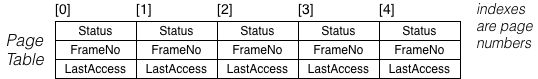

Consider a (very small) virtual memory system with the following properties:
- a process with 5 pages
- a memory with 4 frames
- page table entries containing (Status, MemoryFrameNo, LastAccessTime)
- pages status is one of NotLoaded, Loaded, Modified (where Modified implies Loaded)

Unmodified -> don't write back to hard drive
Modified -> save changes to hard drive

Page table:




If all of the memory frames are initially empty, and the page table entries are flagged as NotLoaded, show how the page table for this process changes as the following operations occur:

```
read page0,  read page4,  read page0,  write page4,  read page1,
read page3,  read page2,  write page2,  read page1,  read page0,
```

Assume that a LRU page replacement policy is used, and unmodified pages are considered for replacement before modified pages. Assume also that access times are clock ticks, and each of the above operations takes one clock tick.

Initial state:
[0]        [1]        [2]        [3]        [4]
NotLoaded  NotLoaded  NotLoaded  NotLoaded  NotLoaded
-          -          -          -          -
-          -          -          -          -

After "read page0" (t=1):
[0]        [1]        [2]        [3]        [4]
NotLoaded  NotLoaded  NotLoaded  NotLoaded  NotLoaded
-          -          -          -          -
-          -          -          -          -

After "read page4" (t=2):
[0]        [1]        [2]        [3]        [4]
NotLoaded  NotLoaded  NotLoaded  NotLoaded  NotLoaded
-          -          -          -          -
-          -          -          -          -

After "read page0" (t=3):
[0]        [1]        [2]        [3]        [4]
NotLoaded  NotLoaded  NotLoaded  NotLoaded  NotLoaded
-          -          -          -          -
-          -          -          -          -

After "write page4" (t=4):
[0]        [1]        [2]        [3]        [4]
NotLoaded  NotLoaded  NotLoaded  NotLoaded  NotLoaded
-          -          -          -          -
-          -          -          -          -

After "read page1" (t=5):
[0]        [1]        [2]        [3]        [4]
NotLoaded  NotLoaded  NotLoaded  NotLoaded  NotLoaded
-          -          -          -          -
-          -          -          -          -

After "read page3" (t=6):
[0]        [1]        [2]        [3]        [4]
NotLoaded  NotLoaded  NotLoaded  NotLoaded  NotLoaded
-          -          -          -          -
-          -          -          -          -

After "read page2" (t=7):
[0]        [1]        [2]        [3]        [4]
NotLoaded  NotLoaded  NotLoaded  NotLoaded  NotLoaded
-          -          -          -          -
-          -          -          -          -

After "write page2" (t=8):
[0]        [1]        [2]        [3]        [4]
NotLoaded  NotLoaded  NotLoaded  NotLoaded  NotLoaded
-          -          -          -          -
-          -          -          -          -

After "read page1" (t=9):
[0]        [1]        [2]        [3]        [4]
NotLoaded  NotLoaded  NotLoaded  NotLoaded  NotLoaded
-          -          -          -          -
-          -          -          -          -

After "read page0" (t=10):
[0]        [1]        [2]        [3]        [4]
NotLoaded  NotLoaded  NotLoaded  NotLoaded  NotLoaded
-          -          -          -          -
-          -          -          -          -
